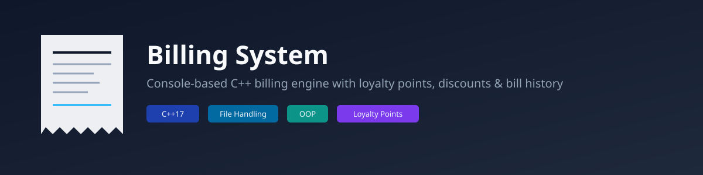

<p align="center">
  
</p>

<h1 align="center">Billing System</h1>
<p align="center">
  A console-based C++ billing application for retail and grocery stores — with multi-product bills, discounts, a customer loyalty points system, and searchable bill history.
</p>

<p align="center">
  
  
  
  
</p>

---

## Overview

Most beginner billing programs just print what you type and forget it the moment the program closes. This one doesn't. It's built to actually simulate how a real super shop counter works:

- Multiple products per bill, with input validation
- Percentage-based discounts
- A loyalty points system — customers earn points on every purchase and can redeem them for a cash discount later
- Every bill saved to a uniquely named file, so nothing is lost
- Past bills searchable by customer name or contact number, straight from the console

## Features

| Feature | Description |
|---|---|
| 🧾 Multi-product billing | Add any number of products to a single bill with quantity and price validation |
| 💸 Discounts | Apply a percentage discount to the total automatically |
| ⭐ Loyalty points | Earn 10 points per 100 Tk spent; redeem points (1 point = 0.1 Tk) for a discount on future purchases |
| 📁 Persistent bill storage | Each bill is saved as `bill_<no>_<name>_<contact>.txt` for permanent record-keeping |
| 🔍 Bill search | Look up any past bill instantly by customer name or contact number |
| ✅ Input validation | Prevents invalid entries for prices, quantities, and menu selections |

## How it's built

The system is structured around two core classes:

- **`Product`** — encapsulates a single product's name, quantity, and price, with a reusable `getTotalPrice()` and `display()` method.
- **`Bill`** — manages the full billing flow: calculating totals, applying discounts, handling loyalty point redemption/earning, printing a formatted receipt, and saving/searching bill files.

Loyalty points persist across sessions via `loyalty.txt`, loaded and saved through dedicated `loadLoyaltyPoints()` / `saveLoyaltyPoints()` functions. Bill search uses C++'s `<filesystem>` library to scan the working directory for matching filenames.

## Example output

```
=============== Super Shop Bill ===============
Bill No: 4916        Date: Mon Sep 08 19:41:34 2025
Customer: Zakir Khan
Contact No: 016314465878
Product             Qty       Price/unit     Total
------------------------------------------------
Chips               5         50             250
KitKat               5         80             400
------------------------------------------------
                                Total: 650
                             Discount: 32.5
                       Redeem Discount: 0
                          Grand Total: 617.5
Loyalty Points Earned: 60
Total Loyalty Points: 280
================================================
    Thank You for Shopping!
```

## Getting started

**Requirements:** a C++17-capable compiler (e.g. `g++` 8+)

```bash
git clone https://github.com/armanbin007/Billing-System.git
cd Billing-System
g++ -std=c++17 "Billing System/Updated_billing_system.cpp" -o billing_system
./billing_system
```

## Usage

1. Enter customer details and add one or more products to the bill
2. Apply a discount if needed
3. If the customer has existing loyalty points, choose whether to redeem them
4. Review the printed receipt — it's saved automatically as a text file
5. Use the search menu at any time to pull up a previous bill by name or contact number

## Author

Built by [Arman Bin Alauddin](https://github.com/armanbin007) as part of the **Software Development I** course (CSE 1290) at Northern University Bangladesh.
